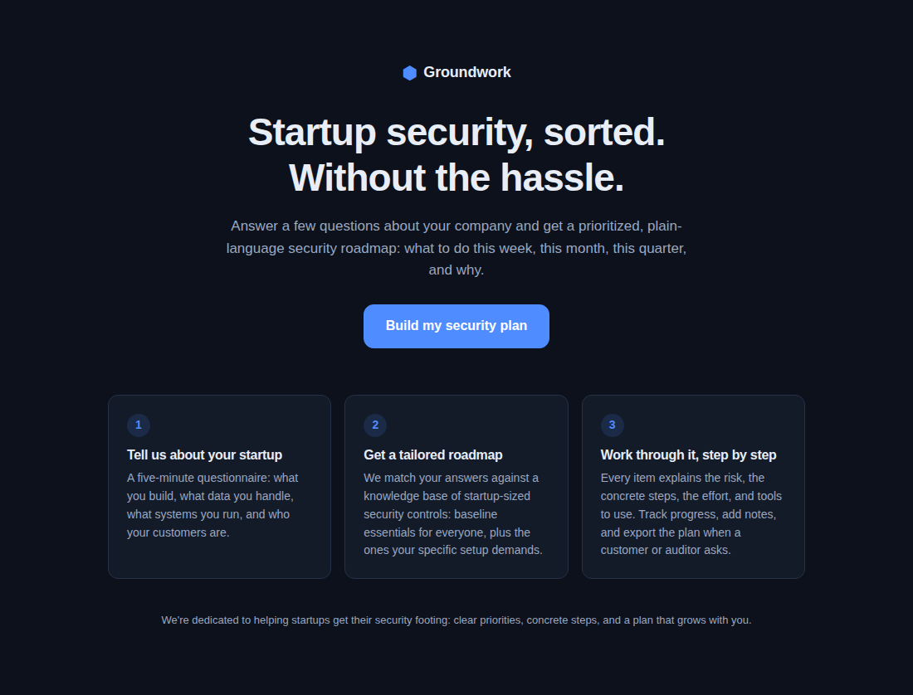
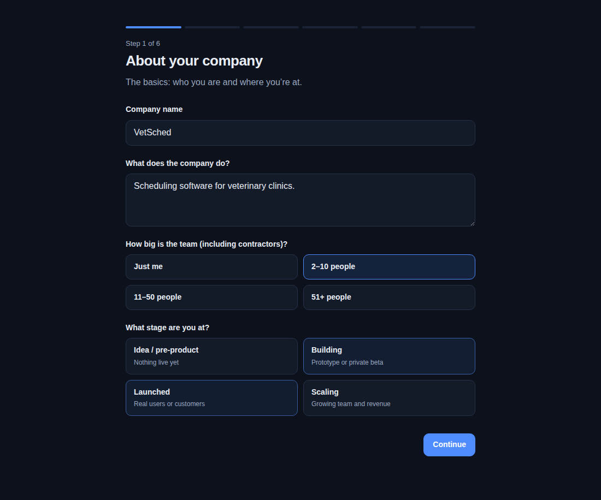
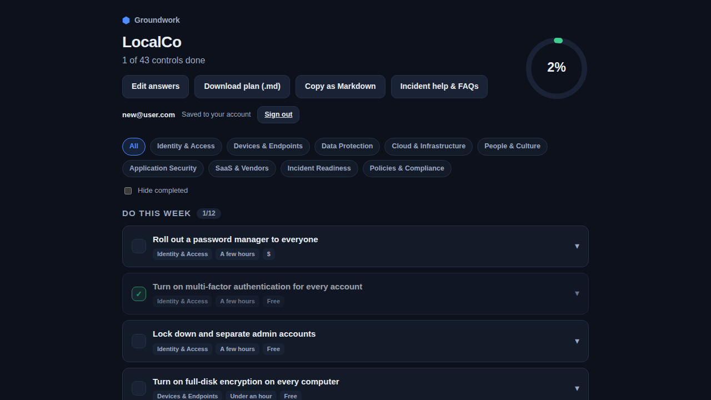
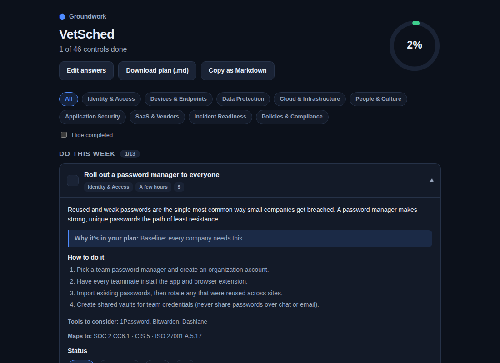

# Groundwork

**Startup security, sorted. Without the hassle.**

Groundwork gives early-stage companies a tailored, prioritized cybersecurity
roadmap. Answer a short questionnaire about what your company does, what data
it handles, and what systems it runs. Groundwork matches your answers against
a knowledge base of ~50 startup-sized security controls and produces a phased
plan: what to do this week, in the first 30 days, the first 90 days, and as
ongoing habits.

## Screenshots

| Landing | Onboarding wizard |
| --- | --- |
|  |  |

| Roadmap dashboard | Control detail |
| --- | --- |
|  |  |

## How it works

1. **Onboarding wizard** (6 steps, ~5 minutes): company basics, product &
   data types, infrastructure & code hosting, ways of working, customers &
   compliance drivers, and what you already have in place.
2. **Rules engine** (`src/engine/plan.ts` + `src/data/controls.ts`): every
   control in the knowledge base is either *baseline* (everyone gets it) or
   carries a `when` rule that returns a profile-specific reason it applies.
   `promote` rules pull controls into earlier phases when the stakes are
   higher (e.g. encryption at rest moves to "this week" for health data).
   Measures you already have are pre-marked done.
3. **Dashboard**: phased checklist with per-control guidance: the risk in
   plain language, concrete steps, suggested tools, effort/cost estimates,
   and mappings to SOC 2 / ISO 27001 / CIS / GDPR / HIPAA / PCI for when
   auditors or enterprise questionnaires come knocking. Track status
   (to do / in progress / done / N/A), add notes, filter by category, and
   export the whole plan as Markdown.

The app runs client-side, with profile and progress persisted in
`localStorage`.

## Development

```bash
npm install
npm run dev       # local dev server
npm test          # engine + knowledge-base tests (vitest)
npm run build     # type-check + production build to dist/
```

## Extending the knowledge base

Add a control to `src/data/controls.ts`:

- give it a unique `id`, a `category`, and a default `phase`;
- either mark it `baseline: true` or write a `when(profile)` rule returning
  a human-readable reason (or `null`);
- optionally add a `promote(profile)` rule to escalate urgency, `tools`,
  `frameworks` tags, and a `satisfiedBy` existing-measure mapping.

The test suite verifies knowledge-base integrity (unique ids, rules present,
substantive guidance) automatically.
